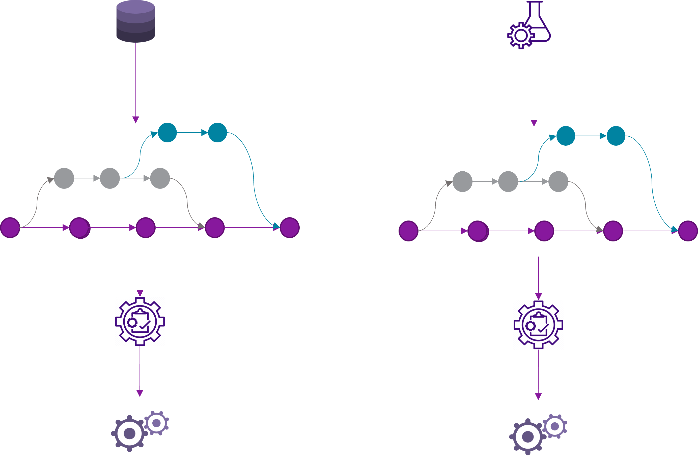
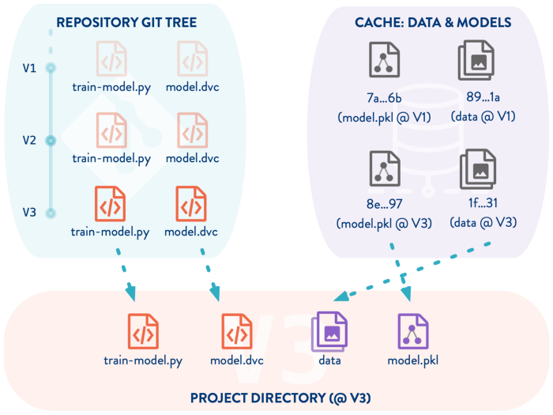
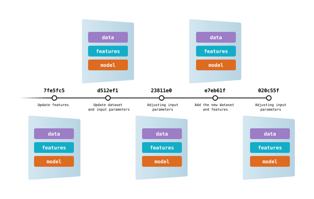
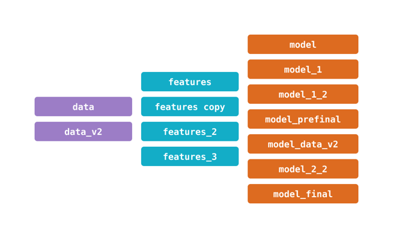

## Demo

## Introduction to DVC

#### Versioning Data and Code


#### Summary of DVC Versioning


#### Complete Commit history


#### All components tracked


    https://github.com/jai2shan/DataVersionControl_DVC

## Basics tutorial for DVC

    https://dvc.org/doc/use-cases/versioning-data-and-models/tutorial

## Similar tools in the market

mlflow, kubeflow, neptune, pachyderm etc.,

# Demo
### *Every step below is followed with a commit*
1) We will setup git and dvc to track code, data and models specifically in Azure Blob Storage
2) Setup cloud location for data to store the data
3) Add Version 1 data with 500 training records(Titanic dataset)
4) Add python code to build models
5) Train a Logistic Regression model on Version 1 data
6) Add Version 2 of the data with 800 training records
7) Train a Logistic Regression model on Version 2 data
8) Train a Random Forest model on Version 2 data
9) Clone the repository locally into the different location         
10) Sync the data and re run the scripts

---
> Create a git repository in github.com       
> Clone the repository   
> Initiate DVC in the git repository      
``` 
    dvc init    
```       
> Set up Azure blob storage   
  
> Add the special permissions for this type of request:         
   . Storage Blob Data Contributor           
   . Storage Queue Data Contributor          

> Create a additional folder in the blob storage where you want to add your data
    
    az account list --output table  

        
> Activating the required Azure subscription

    az account set --subscription b99a3d53-4546-410d-8236-ddc98cb9e9cd

> Add the remote directory for data

    dvc remote add -d titanic azure://dvc-demo

> Modify the storage account name    

     dvc remote modify titanic account_name 'gdpdeva3suks'

> Copy the files to Data folder in dvc. Add Data to dvc.

    dvc add Data

> Commit dvc config file to git. Add and commit all untracked files

    git add .
    git commit -m "Version 1 - Data"
    
> Push the data to Cloud location

    dvc push

> Copy the training scripts and config.yaml     
> Do a git commit

    git add .
    git commit -m "Training Scripts"

> Create a model folder and add the same to the dvc

    dvc add model

> Run the python training

    python3 -m training

> Once the model ran successfully we can commit the current state to git

    git add .
    git commit -m "Version 1 Model Run"
    dvc push
    git push

> Add new Version of the data

    dvc status
    dvc add Data
    git status
    git commit -m "Version 2 Data"
    git push origin main

> Change to a different location, create a new folder, sync the data and rerun the scripts


/mnt/c/Users/jayasans4085/OneDrive - ARCADIS/Documents/Learning/